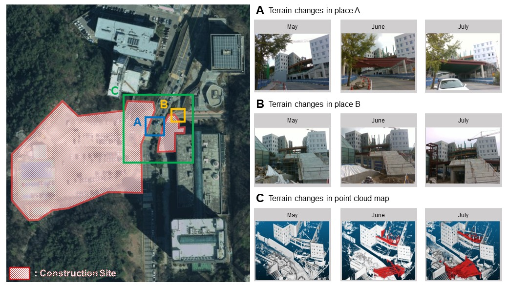
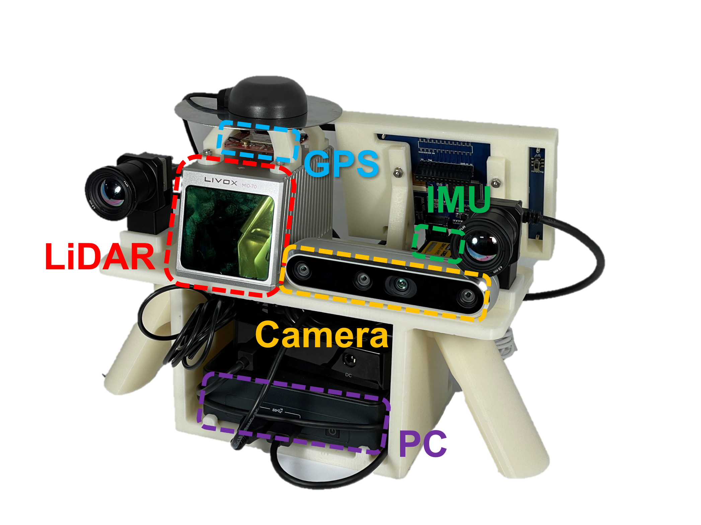
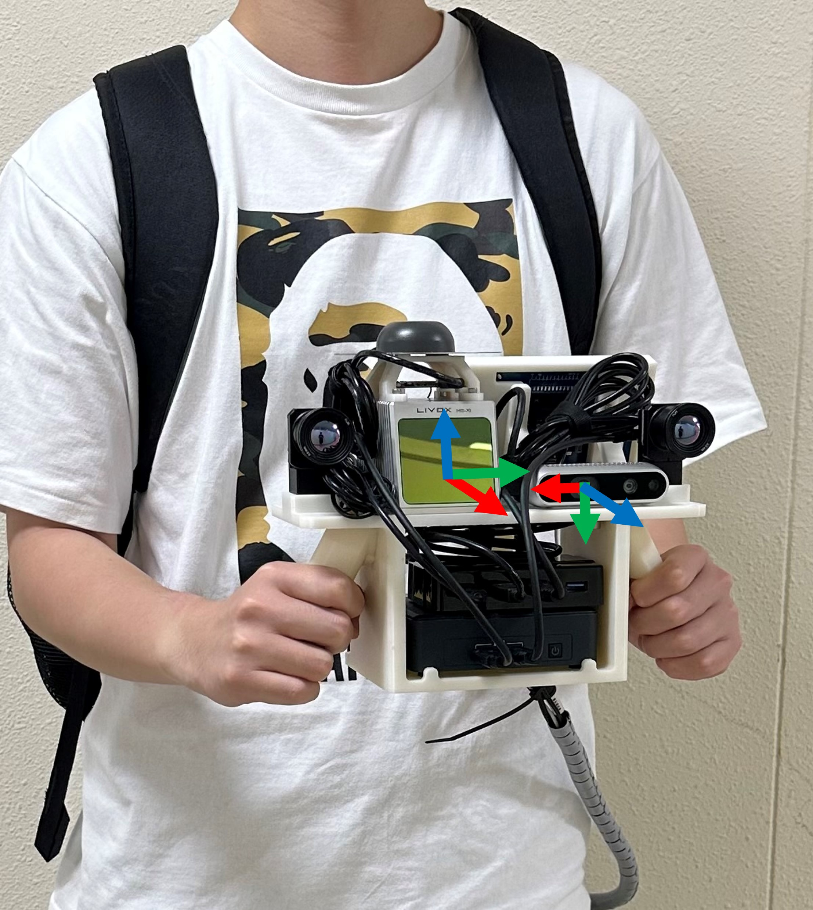

<h1 align="center"> ConPR: Ongoing Construction Site Dataset <br/> for Place Recognition </h1>
<p align="center">
<a href="https://tinyurl.com/DongjaeLEE0107"><strong>Dongjae LEE</strong></a>
·
<a href="https://minwoo0611.github.io/about/"><strong>Minwoo JUNG</strong></a>
·
<a href="https://ayoungk.github.io/"><strong>Ayoung KIM</strong></a>
</p>

<!-- <h3 align="center">IROS 2023 Workshop Paper</a> -->

<p></p>

<p align="center">

</p>

</h3>
<div align="center"></div>
</p>

## Dataset

### Ongoing Construction Site Dataset
Our dataset includes various data collections from the area around the construction site, showing the ongoing construction process. This enables researchers to evaluate place recognition algorithms in dynamic environments with changing conditions.

### Sensor Configuration
The handheld system with a monocular camera and a 3D solid-state LiDAR was used to acquire sensor data. In addition, we have also attached an IMU and GPS to the system to enable its utilization for other purposes (e.g., visual-inertial odometry, LiDAR-inertial odometry).

| Sensor     | Manufacturer | Model           | Description                                                       | Hz  |
|------------|--------------|-----------------|-------------------------------------------------------------------|-----|
| RGB Camera | Intel        | RealSense D435i | Global shutter RGB-D camera, (640,480) resolution               | 30  |
| 3D LiDAR   | Livox        | Mid-70          | Scanning LiDAR, circular FOV of  70.4&deg;             | 10  |
| IMU        | MicroStrain  | 3DM-GX5-AHRS    | High performing Attitude and Heading Reference System             | 250 |
| GPS        | u-blox       | ZED-F9P         | Multi-band GNSS receiver providing centimeter level accurate pose | 10  |

<p float="center">
  
   
</p>

### Data Format
```
ConPR
  ├─Calibration
  │      calibration_cam.yaml
  │      calibration_gps.yaml
  │      calibration_imu.yaml
  │      calibration_lidar.yaml
  │      cameraParameter.txt
  │      report.pdf
  │
  └─YYYYMMDD
      │  data_stamp.csv
      │  pose.csv
      │  imu.csv
      │
      ├─Camera
      │	  TIME_STAMP.png
      │
      └─LiDAR
          TIME_STAMP.bin
```
- RGB Camera
	- The monocular images acquired at 30Hz are stored in **Camera** folder. Each image is named by its timestamp.
- 3D LiDAR
	- 3D LiDAR data is stored in **LiDAR** folder in floating point binary format. Each binary file is named by its timestamp.
	- The data format follows the Livox custom pointcloud format. For more detailed information, please refer to this <a href="https://github.com/Livox-SDK/livox_ros_driver/blob/master/livox_ros_driver/msg/CustomPoint.msg">link</a>.
- IMU
	- **'imu.csv'** stores the orientation, angular velocity and linear acceleration data measured by IMU sensor.
	- [time_stamp, quaternion x, quaternion y, quaternion z, quaternion w, angular velocity x, angular velocity y, angular velocity z, linear acceleration x, linear acceleration y, linear acceleration z]	
- Pose (SLAM + GPS)
  - RTK did not function properly due to the presence of numerous tall buildings, and raw GPS experienced difficulties when passing under the bridge. Furthermore, the outdoor setting prevented us from using a laser scanner for ground truth generation.
  - Therefore, we provide positions that represents a path of the handheld systme as ground truth information in local IMU coordinate, generated using SLAM.
  - The positions for each sequence were generated using <a href="https://github.com/hku-mars/FAST_LIO">FAST-LIO2</a>, and then transformed into a reference IMU frame using GPS measurement and G-ICP, which utilized only the static regions.
  - The ground truth information can be found in the **'pose.csv'**.
  - [time_stamp, x, y, z]
- DataStamp
	- **'data_stamp.csv'** provide the timestamps and the names of all sensor data in order.
	- File Player needs **'data_stamp.csv'** to publish sensor data in order.  
- Calibration Data
	- The calibration results between the sensors are stored in **Calibration** folder.


## Download
<a href="https://drive.google.com/drive/folders/1jbKrrJGG56p9uusLyne1WrwwEmXSNHce?usp=sharing"><strong>Download Link</strong></a>

### File Player
- If you want to publish sensor data as ROS messages, you can use <a href="https://github.com/dongjae0107/ConPR/tree/main/file_player"><strong>File Player</strong></a>
```
roslaunch file_player file_player.launch
```
- Press the Load button and select the folder containing the files (e.g. "YYYYMMDD")
- Press the Open button and click on Play to start the playback.

## Citation
If you use our dataset for your project, please cite our paper.
```
@inproceedings{
lee2023conpr,
title={Con{PR}: Ongoing Construction Site Dataset for Place Recognition},
author={Dongjae LEE and Minwoo Jung and Ayoung Kim},
booktitle={IROS 2023 Workshop on Closing the Loop on Localization: What Are We Localizing For, and How Does That Shape Everything We Should Do?},
year={2023},
url={https://openreview.net/forum?id=I0gHRlQ5Xb}
}
```

## License
### For Dataset
All datasets on this page are copyrighted by SNU RPM Labs and published under the <a href="https://creativecommons.org/licenses/by-nc-sa/4.0/"><strong>Creative Commons Attribution-NonCommercial-ShareAlike 4.0 License</strong></a>. You must attribute the work in the manner specified by the author. You may not use the work for commercial purposes, and you may only distribute the resulting work under the same license if you alter, transform, or create the work

### For Code
This code is licensed under the terms of the MIT license. See the [LICENSE](LICENSE.md) file for license rights and limitations.